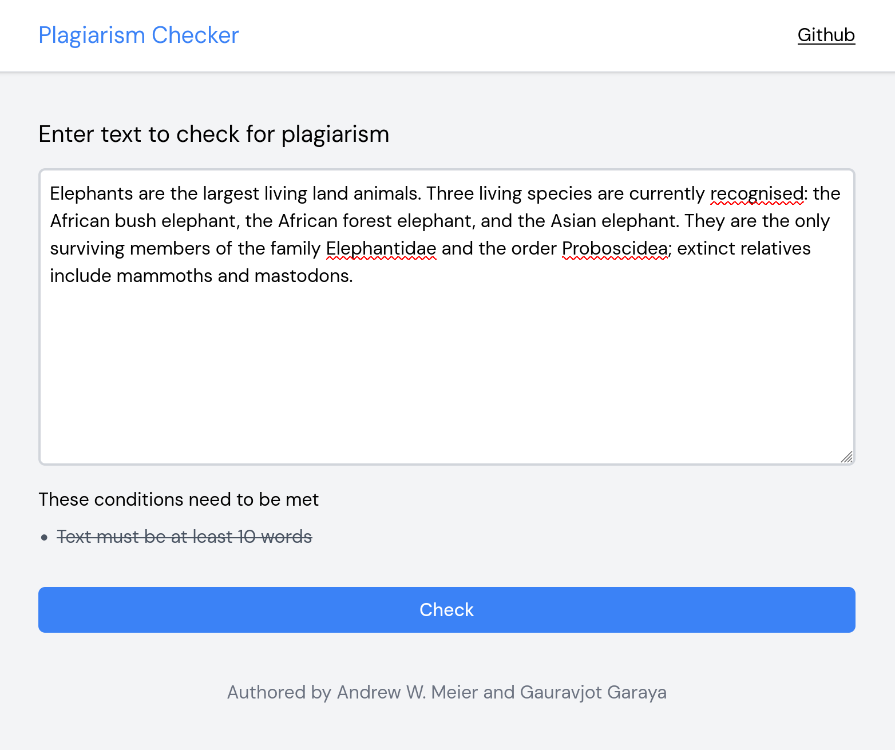
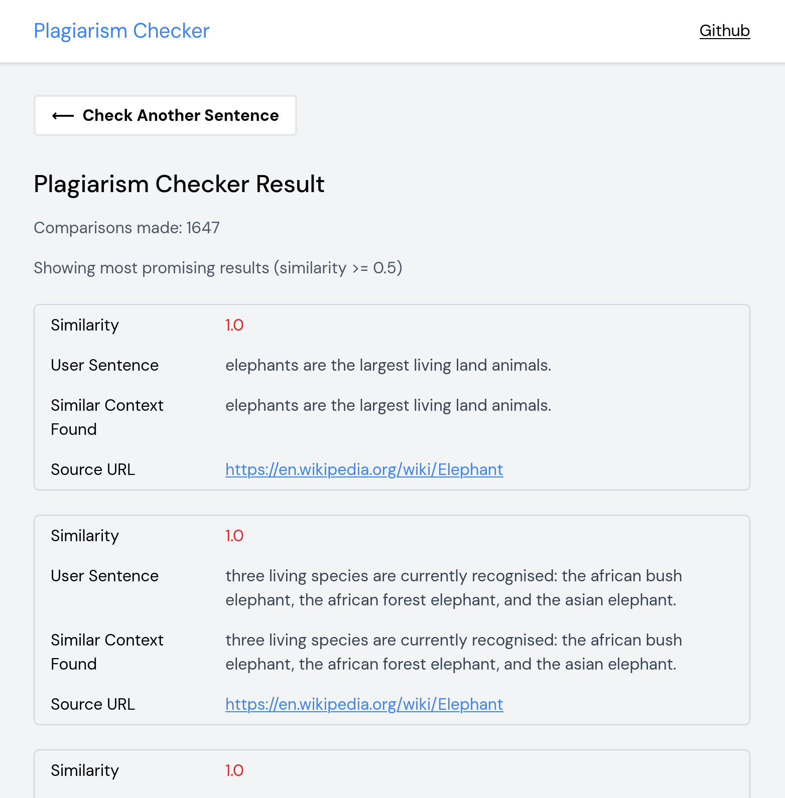

# PlagiarismChecker

A plagiarism checker for a final project

## How to run

1. Clone this repository and make a virtual environment.

    - Windows

        ```powershell
        python -m venv .venv
        ```

        ```powershell
        .\.venv\Scripts\activate
        ```

    - Linux

        ```bash
        python3 -m venv .venv
        ```

        ```bash
        source ./.venv/bin/activate
        ```

2. Install the required packages.

    ```bash
    python -m pip install -r requirements.txt
    ```

3. Start the webserver.

    ```bash
    python server.py
    ```

4. Go to [http://127.0.0.1:5000](http://127.0.0.1:5000) to access the application.

## Screenshots

### Homepage



### Results



## The Algorithm

The algorithm for creating scores and checking for plagarism is as follows:

### Preprocessing

1. Using beatiful soup and google search get the top 3 results for the user inputed text.
2. Using the top 3 results, get the paragraph text from each of the results. While getting the paragraph text, we tokenize it into sentences using nltk in the data_cleanup function.
3. Store the sentences in a source object. Each source object has a URL property and a sentences property. These source objects are kept in an array.
4. Turn the user inputed text into sentences using nltk in the data_cleanup function.

### Generating scores

5. Now with the user inputed sentences and the source sentences, we can compare them using our algorithm. Every sentence the user input is compared to every sentence in the results from the web scraping.
6. For each source object:

    - For each sentence in the source object:
        - For each sentence in the user-inputted text:
            - Compare the two sentences using the compare function.
            - If the score is greater than 0.5, we consider it worthwhile for the user to look at.

7. Scores are calculated by turning each sentence into a set of words. We then take a jaccard similarity of the two sets.

### Examples of some user inputs

**Test Cases:**

1. **Fully Plagiarized (Several Matches with 1.0 similiarity):**
   Many high schools across the country have brought much attention to the idea of giving random drug tests to students in high school. The newfound interest in student drug testing may be as a result of recent polls, which have shown an increase in drug use among high school students.

2. **Plagiarized with Slight Modification (One Match 0.6956):**
   A lot of high schools across the country have brought some attention to giving random drug tests in high school. This new interest in student drug testing might be from recent poll results, which show an increase in drug use from students.

3. **Not Plagiarism (No Matches):**
   Newfound polls show that there is an increase in drug use among high school students. This brings attention to the idea of random drug testing in schools
